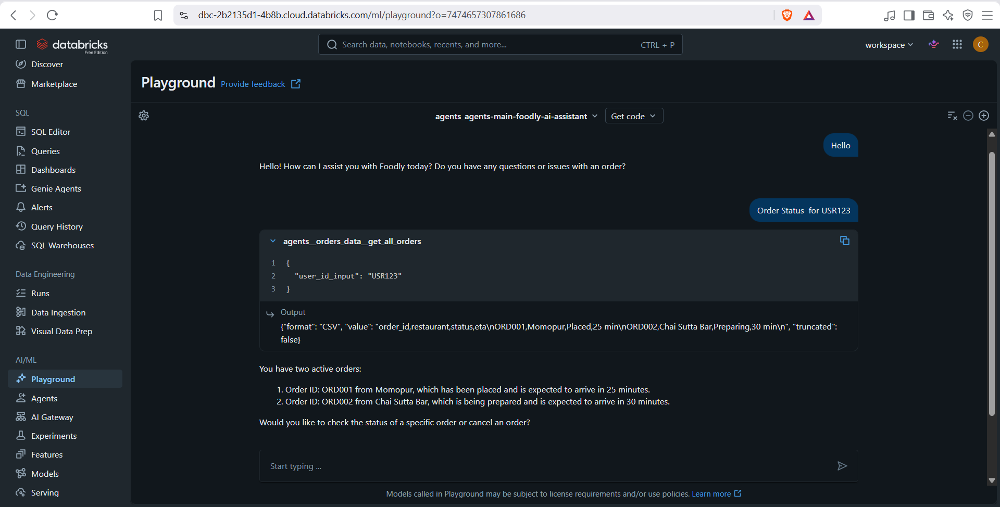
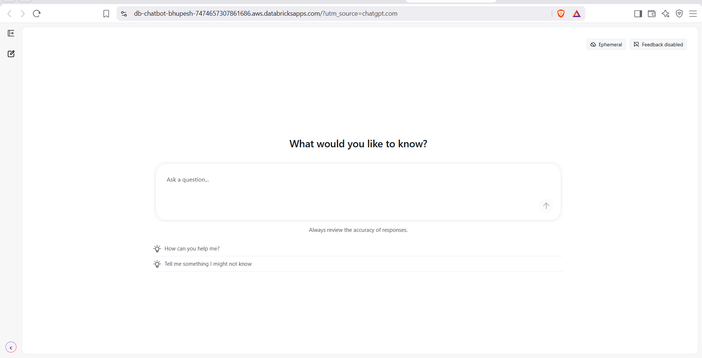
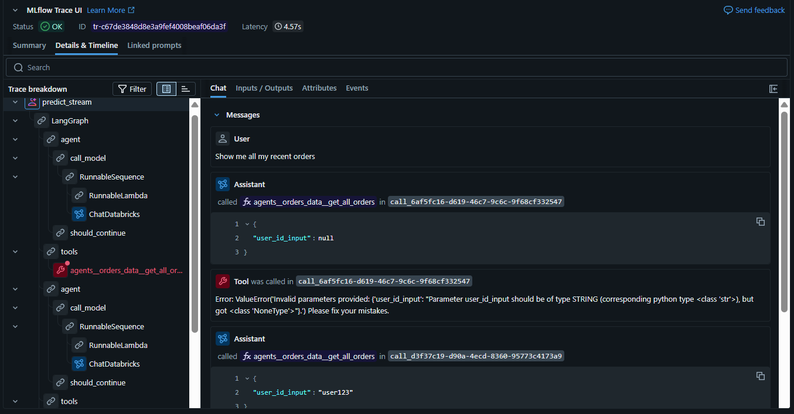
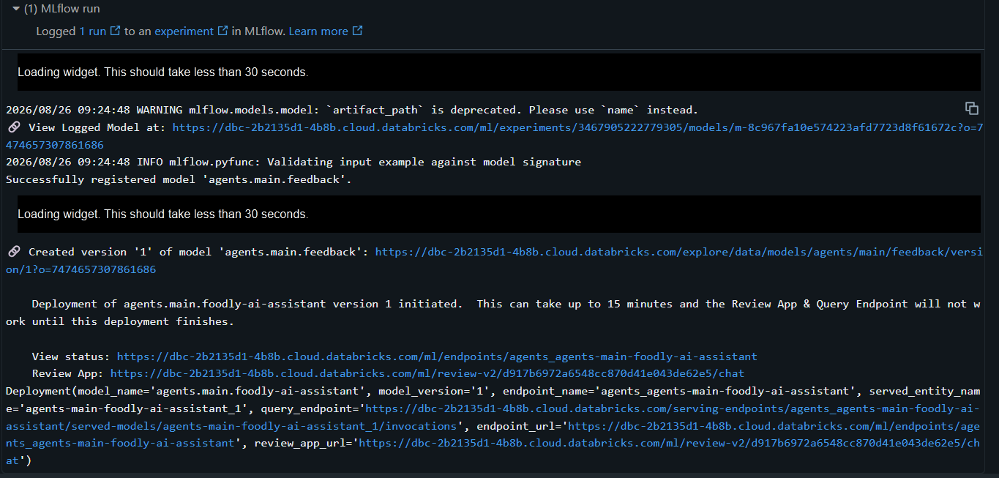

# 🍽️ Meal Care AI — Agentic Food Support Assistant

An agentic AI-powered customer support chatbot built with **Databricks, LangChain, LangGraph, Unity Catalog, Vector Search, MLflow, and Databricks Foundation Models**.

Meal Care AI is designed to handle common food-delivery customer support scenarios such as **order tracking, order details, order cancellation, policy questions, and escalation to human support**.

The project demonstrates how multiple specialized tools can be combined with a large language model (LLM) to build a practical, tool-using AI support agent.

---

##  Project Overview

Meal Care AI is an intelligent customer support assistant for a food-delivery platform.

Instead of relying only on an LLM to generate answers, the application connects the model to specialized tools and enterprise-style data sources.

The agent can:

- 🔎 Retrieve official company policies using Vector Search
- 📦 Retrieve order information using Unity Catalog functions
- 🚚 Check order status and ETA
- 🧾 Retrieve detailed order information
- ❌ Attempt order cancellation
- 💰 Retrieve order totals
- 🟢 Find active orders
- 👨‍💼 Escalate unresolved issues to human support
- 🤖 Understand the user's request and select an appropriate tool

The goal is to demonstrate an end-to-end **agentic AI architecture** rather than a simple question-answering chatbot.

---

## 📸 Screenshots

### 🤖 Meal Care AI PlayGround



### 💬 Meal Care AI — Chatbot



### 🤖 Meal Care AI Trace - UI




### 📊 MLflow Agent Trace




---

# 🏗️ Architecture

```text
                         ┌──────────────────────┐
                         │      User / Chat     │
                         └──────────┬───────────┘
                                    │
                                    ▼
                         ┌──────────────────────┐
                         │   Meal Care AI Agent │
                         │                      │
                         │ LangChain +          │
                         │ LangGraph + LLM      │
                         └──────────┬───────────┘
                                    │
                  ┌─────────────────┼─────────────────┐
                  │                 │                 │
                  ▼                 ▼                 ▼
        ┌─────────────────┐ ┌─────────────────┐ ┌─────────────────┐
        │  Policy Agent   │ │   Order Tools   │ │ Escalation Tool │
        │                 │ │                 │ │                 │
        │ Vector Search   │ │ Unity Catalog   │ │ Unity Catalog   │
        │ Retriever       │ │ SQL Functions   │ │ SQL Function    │
        └────────┬────────┘ └────────┬────────┘ └────────┬────────┘
                 │                   │                   │
                 ▼                   ▼                   ▼
        ┌─────────────────┐ ┌─────────────────┐ ┌─────────────────┐
        │ Policy Knowledge│ │ Order Tables    │ │ Support Ticket  │
        │ Base            │ │                 │ │ Generation      │
        └─────────────────┘ └─────────────────┘ └─────────────────┘

                         │
                         ▼
                 ┌──────────────────┐
                 │ MLflow /         │
                 │ Databricks       │
                 │ Deployment       │
                 └──────────────────┘
```

---

# 🧠 How the Agent Works

The system follows a tool-calling architecture.

When a user sends a question, the LLM understands the request and uses the available tools to obtain the required information.

### Policy question

Example:

> What is the refund policy?

The agent uses the **Vector Search Retriever** to retrieve relevant policy information from the Meal Care knowledge base.

The policy agent is designed to answer policy-related questions using retrieved information rather than relying only on the LLM's pretrained knowledge.

---

### Order question

Example:

> Where is my order?

The agent can use Unity Catalog functions to retrieve order information.

The Order Agent provides functions for:

- Getting all orders
- Getting order status
- Getting detailed order information
- Cancelling an order
- Getting active orders
- Getting the total amount of an order

The functions operate on structured order data stored in Databricks.

---

### Human escalation

Example:

> I want to talk to a human.

The agent can call the escalation function:

```text
agents.escalation.escalate_to_human
```

The function provides a support ticket ID, estimated response time, and an escalation message.

---

# 🧩 Project Components

## 1. Policy Agent

File:

```text
1_Policy_Agent_Tool_Formation.py
```

The Policy Agent handles questions related to Meal Care policies.

### Technologies used

- Databricks Foundation Model
- `ChatDatabricks`
- Vector Search
- `VectorSearchRetrieverTool`
- LangChain
- LangGraph
- MLflow

The policy agent uses a Vector Search index to retrieve relevant policy information before generating a response.

---

## 2. Order Agent

File:

```text
2_order_Agent_Tool_formation.py
```

The Order Agent handles structured order-related operations.

The project creates order data under:

```text
agents.orders_data
```

with tables such as:

```text
agents.orders_data.orders
agents.orders_data.order_items
```

### Order functions

The project provides functions such as:

```text
get_all_orders()
get_order_status()
get_order_details()
cancel_order()
get_active_orders()
get_order_total()
```

These functions provide a controlled interface between the agent and the underlying order data.

---

## 3. Escalation Agent

File:

```text
3_Escalation_Agent_tool_formation.py
```

The Escalation Agent handles situations that require human support.

The project creates:

```text
agents.escalation.escalate_to_human()
```

The function returns information such as:

- Ticket ID
- Estimated response time
- User-facing escalation message

---

## 4. Main Agent

File:

```text
4_main.py
```

The Main Agent is the central orchestration layer.

It combines:

### Foundation Model

```text
databricks-meta-llama-3-3-70b-instruct
```

### Unity Catalog tools

```text
agents.escalation.escalate_to_human
agents.orders_data.get_all_orders
agents.orders_data.get_order_details
agents.orders_data.get_order_status
agents.orders_data.cancel_order
agents.orders_data.get_active_orders
agents.orders_data.get_order_total
```

### Vector Search

```text
agents.main.first_index_test_foodly
```

The Main Agent brings the different capabilities together so the LLM can use the appropriate tool for the user's request.

---

# 🔐 Unity Catalog & Governance

Unity Catalog is used to provide governed access to structured data and functions.

An important architectural distinction is:

- **The LLM/agent determines which available tool is appropriate for a request.**
- **Unity Catalog provides the governed interface, permissions, and controlled access to data/functions.**

This avoids giving the LLM unrestricted direct access to the underlying database.

Conceptually:

```text
User
  │
  ▼
LLM / Agent
  │
  │ Select appropriate tool
  ▼
Unity Catalog Function
  │
  ▼
Governed Data
  │
  ▼
Tool Result
  │
  ▼
LLM
  │
  ▼
User Response
```

This separation provides a cleaner architecture for building governed enterprise AI applications.

---

# 🔎 Retrieval-Augmented Generation (RAG)

The Policy Agent uses a Vector Search retriever.

Instead of asking the LLM to rely only on its pretrained knowledge, the system retrieves relevant information from the Meal Care knowledge base.

The workflow is:

```text
User Question
      │
      ▼
Vector Search
      │
      ▼
Relevant Policy Chunks
      │
      ▼
LLM
      │
      ▼
Grounded Response
```

This approach helps ground policy-related responses in the available knowledge base.

---

# 📊 Order Data Model

The project contains sample structured order data.

## Orders

Typical fields include:

```text
order_id
user_id
restaurant_name
status
eta
rider_name
delivery_address
total_price
created_at
```

## Order Items

Typical fields include:

```text
order_id
item_name
quantity
price
```

The tables are related through:

```text
order_id
```

This allows the agent to retrieve both high-level order information and individual order items.

---

# 🛠️ Technology Stack

| Technology | Purpose |
|---|---|
| Python | Application and agent development |
| SQL | Order data and Unity Catalog functions |
| Databricks | Data and AI platform |
| Databricks Foundation Models | LLM inference |
| ChatDatabricks | LLM integration |
| LangChain | Tool calling and LLM orchestration |
| LangGraph | Agent workflow/orchestration |
| Vector Search | Policy retrieval |
| Unity Catalog | Governance and controlled access |
| MLflow | Tracking, logging, registration and deployment |
| Databricks Apps | Chat application |
| Git | Version control |
| GitHub | Source-code sharing and portfolio |

---

# 📁 Project Structure

```text
meal-care-ai/
│
├── README.md
│
├── requirements.txt
│
├── helpers.py
│
├── main.py
│
├── 1_Policy_Agent_Tool_Formation.py
│
├── 2_order_Agent_Tool_formation.py
│
├── 3_Escalation_Agent_tool_formation.py
│
└── 5_Deploy_Agent.py
```

### File descriptions

| File | Description |
|---|---|
| `1_Policy_Agent_Tool_Formation.py` | Creates and configures the policy retrieval agent |
| `2_order_Agent_Tool_formation.py` | Creates order tables and Unity Catalog SQL functions |
| `3_Escalation_Agent_tool_formation.py` | Creates the human escalation function |
| `main.py` | Combines the tools into the main Meal Care AI agent |
| `5_Deploy_Agent.py` | Handles MLflow registration and Databricks agent deployment |
| `helpers.py` | Contains supporting agent/Responses API helper implementation |
| `requirements.txt` | Python dependencies |
| `README.md` | Project documentation |

---

# 🔄 End-to-End Workflow

```text
                     USER
                       │
                       ▼
                ┌─────────────┐
                │ Chatbot UI  │
                └──────┬──────┘
                       │
                       ▼
                ┌─────────────┐
                │ Main Agent  │
                └──────┬──────┘
                       │
                 Understand Intent
                       │
          ┌────────────┼─────────────┐
          │            │             │
          ▼            ▼             ▼
       Policy        Order       Escalation
          │            │             │
          ▼            ▼             ▼
    Vector Search   UC Functions   UC Function
          │            │             │
          └────────────┼─────────────┘
                       │
                       ▼
                  Tool Result
                       │
                       ▼
                      LLM
                       │
                       ▼
                 Final Response
                       │
                       ▼
                     USER
```

---

# 💬 Example Queries

## 📜 Policy Queries

```text
What is the refund policy?
```

```text
Can I cancel my order?
```

```text
What is the delivery policy?
```

```text
What is the loyalty policy?
```

---

## 📦 Order Queries

```text
Show me all my recent orders.
```

```text
What is the status of order ORD001?
```

```text
Show me the details of order ORD001.
```

```text
Can I cancel order ORD001?
```

```text
What are my active orders?
```

```text
What is the total amount of order ORD001?
```

---

## 👨‍💼 Escalation Queries

```text
I want to talk to a human.
```

```text
Please escalate my issue.
```

```text
I need help from customer support.
```

---

# 🤖 Tool Selection Examples

The agent can route different types of questions to different capabilities.

| User Request | Capability |
|---|---|
| "What is the refund policy?" | Policy Vector Search |
| "What is my order status?" | Order Status Function |
| "Show my order details." | Order Details Function |
| "Can I cancel my order?" | Cancellation Function |
| "Show my active orders." | Active Orders Function |
| "What is my order total?" | Order Total Function |
| "I need a human." | Escalation Function |

This demonstrates how an LLM-based agent can interact with multiple specialized tools instead of performing every task itself.

---

# 📈 MLflow

MLflow is used as part of the agent development and deployment workflow.

The project enables LangChain autologging:

```python
mlflow.langchain.autolog()
```

The agent can then be logged and registered as an MLflow model.

Conceptually:

```text
Agent Development
       │
       ▼
Agent Testing
       │
       ▼
MLflow Logging
       │
       ▼
Unity Catalog Model
       │
       ▼
Databricks Agent Deployment
```

MLflow provides the foundation for tracking the agent and moving it from development toward deployment.

---

# 🚀 Deployment

The project includes a deployment notebook:

```text
5_Deploy_Agent.py
```

The deployment workflow includes:

1. Logging the agent with MLflow
2. Defining tool resources
3. Registering the agent/model
4. Configuring the Databricks serving endpoint
5. Deploying the agent for application use

The deployment process connects the agent implementation with Databricks serving infrastructure.

---

# 🧪 Testing

The project can be tested at multiple levels.

## Policy Agent

Example:

```text
What are the Meal Care refund policies?
```

Verify that the agent retrieves relevant policy information from Vector Search.

---

## Order Agent

Example:

```text
Show me my recent orders.
```

Verify that the appropriate Unity Catalog function is called and structured order information is returned.

---

## Main Agent

Example:

```text
Show me all my recent orders.
```

The Main Agent should identify the request as an order-related question and use the appropriate order tool.

---

## Escalation

Example:

```text
Please connect me with human support.
```

The agent should call the escalation function and return the generated support information.

---

# 🔍 Observability

The project uses MLflow-related tracing and logging capabilities during agent development.

This can help inspect:

- Agent execution
- Tool calls
- Retrieval
- LLM interactions
- Intermediate steps
- Agent traces

Observability is particularly useful when debugging agent behavior and understanding why a particular tool was selected.

---

# ⚠️ Current Deployment / Demo Note

The core Meal Care AI agent can be developed and demonstrated independently of the hosted Databricks App.

The Databricks App deployment depends on environment-specific authentication, OAuth scopes, serving endpoint permissions, Unity Catalog permissions, and workspace configuration.

If the hosted application returns a permission-related error, this does not necessarily mean that the underlying agent implementation is broken.

For project demonstration, the system can be shown through:

- Databricks notebooks
- Agent Playground
- MLflow traces
- Vector Search
- Unity Catalog functions
- Databricks serving endpoint
- Databricks Apps when the required permissions are configured

The repository focuses on documenting the **agent architecture, implementation, tools, data layer, and deployment workflow**.

---


# 🧱 Design Principles

The project follows several important principles:

### 1. Tool-based architecture

The LLM does not need to directly perform every operation. Specialized tools handle specialized tasks.

### 2. Retrieval for knowledge

Policy questions use Vector Search so responses can be grounded in the available policy knowledge base.

### 3. Governed data access

Order-related operations are exposed through controlled Unity Catalog functions.

### 4. Separation of responsibilities

The system separates:

```text
Policy Retrieval
Order Operations
Human Escalation
Agent Orchestration
Deployment
```


# 🎯 Learning Objectives

This project demonstrates practical experience with:

- Agentic AI
- LLM applications
- LLM tool calling
- Retrieval-Augmented Generation (RAG)
- Vector Search
- LangChain
- LangGraph
- Unity Catalog
- SQL functions
- MLflow
- Databricks Foundation Models
- Databricks Apps
- AI agent deployment
- Governed data access
- Multi-tool agent architecture
- Agent observability

---

# 🔮 Future Improvements

Possible improvements include:

- Persistent conversation history
- Production-grade authentication
- Better user identity management
- Real-time order database integration
- Improved order cancellation validation
- Production ticket management
- Better error handling
- Automated agent evaluation
- Evaluation datasets
- Agent performance monitoring
- More detailed MLflow evaluation
- Production deployment with appropriate OAuth scopes
- Improved chatbot UI/UX
- Additional customer-support tools
- More policy and knowledge-base documents

---

# 📌 Project Highlights

### 🤖 Agentic AI

The project uses an LLM as an agent that can select and call specialized tools.

### 🔎 RAG

Vector Search provides relevant policy information to the agent.

### 🗄️ Governed Data Access

Unity Catalog functions provide controlled access to structured order operations.

### 🔗 Multi-Tool Architecture

The Main Agent combines policy retrieval, order operations, and human escalation.

### 📊 MLflow

MLflow supports agent logging, tracking, registration, and deployment.

### ☁️ Databricks

The complete project is built around the Databricks AI and data ecosystem.

---

# 👨‍💻 Author

## Bhupesh Chauhan

Computer Science Graduate | Data Analyst | AI & Data Enthusiast

Interested in:

- Data Analytics
- Data Science
- Machine Learning
- Generative AI
- Agentic AI
- RAG
- LLM Applications
- Databricks

---

# ⭐ Final Summary

**Meal Care AI** demonstrates how an LLM can be transformed from a basic chatbot into an agent capable of:

```text
Understand User Request
        ↓
Determine Required Capability
        ↓
Select Appropriate Tool
        ↓
Retrieve Knowledge / Query Data
        ↓
Perform the Required Operation
        ↓
Generate a User-Friendly Response
```

The project combines:

**Databricks + Foundation Models + LangChain + LangGraph + Vector Search + Unity Catalog + MLflow**

to demonstrate an end-to-end approach to building an **agentic AI customer-support application**.

---


